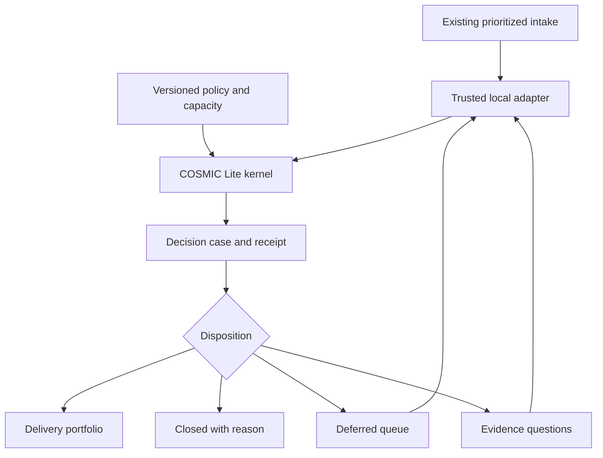

# The Intake Decision Observatory

**Turn every intake into a decision case that can be resolved asynchronously. Convene people only for the questions the system cannot resolve.**

Prepared for TJ and Marle · COSMIC Lite intake edition 0.1.0 · 16 September 2026

## 1. The product idea

TJ already built prioritization. Preserve it. The missing product answers: given the evidence, delivery constraints, and approved decision rules, which of these prioritized requests should enter the delivery portfolio?

An intake earns a case file. The case contains its intended outcome, authoritative evidence, dependencies, estimated effort, timing, and the exact rules that determine its disposition. Small reasoning modules examine the same case from different angles. A deterministic gate produces a decision and a receipt. Missing facts become assigned questions. A material change produces a new case revision and decision.

The creative center is the **decision observatory**: stakeholders can see why something is ready, why it was declined, what is preventing admission, and what would change the answer. The application should feel like a place where decisions become clear.

This design replaces recurring reconciliation work with visible evidence and explicit rules. Whether it can replace every part of ISR depends on what that program actually does locally; this package implements the decision kernel, not a verified replacement of the unseen program.

## 2. Four outputs, two separate questions

First establish whether a request is admissible. Then determine whether it fits in the current portfolio.

| Decision | Meaning | Expected next action |
|---|---|---|
| BUILD | Evidence is sufficient; the request passes policy and declared challenge; its dependency bundle fits capacity and the conservative schedule | Admit to the proposed delivery plan through the configured authority |
| REJECT | An authoritative, current fact satisfies an explicit rejection predicate | Close with the cited policy and evidence; allow reopening on new evidence or policy |
| DEFER | The request cannot be admitted in this window because of capacity, timing, or a blocked prerequisite | Retain rank, expose the blocker, and reevaluate when it changes |
| NEEDS_EVIDENCE | Required facts are unknown, contradictory, malformed in substance, or the case fails a declared challenge | Send a precise question to the accountable owner |

Malformed transport data returns an operational REFUSED error. REFUSED is not a business rejection. If a required engine crashes, the wrapper must record an incomplete evaluation and refrain from issuing a decision.

REJECT is deliberately narrow. A missing cost estimate cannot prove a request is bad. Exhausted capacity cannot prove its need is invalid. An identified policy disqualifier can establish rejection even when irrelevant estimates are absent.

## 3. The ten-engine edition

These are explicit local scopes, not claims of parity with the full engines. Each module is callable and has a concrete implementation in this package.

| Engine | Local application label | Implemented Lite responsibility | Limit |
|---|---|---|---|
| METEOR | Request map | Exact intake identities, dependency references, missing references, and cycle detection | No semantic entity resolution or inferred duplication |
| COMET | Evidence trail | Bind claim to subject and field; enforce configured issuer allowlist; retain source reference and digest; exclude invalid evidence | Adapter must authenticate issuer and verify original bytes |
| ASTRAL | Intake normalization | Validate one strict versioned JSON contract; normalize processing order | No automatic free-text interpretation or implicit unit conversion |
| NEBULA | Evidence readiness | Resolve each field as KNOWN, UNKNOWN, or CONFLICT; show required-field coverage | Coverage is not probability or calibrated confidence |
| QUASAR | Decision case | Combine admitted benefit/cost intervals in declared common units and horizon | No reprioritization or portfolio optimality claim |
| NOVA | Outcome assumptions | Evaluate a declared intervention scenario from admitted estimates and named mechanism/metric | Sensitivity arithmetic, not causal identification |
| ECLIPSE | Delivery window | Check elapsed delivery against horizon/deadline; feed conservative bundle scheduling | No stochastic forecasts or full resource scheduling |
| PULSAR | Challenge | Test one declared benefit-realization/cost-stress scenario and challenge zero estimates | No exhaustive adversarial proof |
| AURORA | Decision gate | Apply explicit disqualifiers, evidence requirements, timing, and portfolio admission | Authority comes from deployed policy and workflow, not engine branding |
| CHRONOS | Evidence clock | Apply a pinned evaluation time and half-open evidence validity intervals | No time-series inference, event store, or automatic refresh service |

CHRONOS supports evidence admission across the pipeline. ASTRAL runs first in this implementation because external data must be validated before other modules can use it. Engine names preserve the conceptual connection; the local application can use the plain labels above.

The five TJ identified carry the spine: METEOR maps the request; COMET connects claims to evidence; NEBULA preserves uncertainty; PULSAR challenges the case; AURORA issues the bounded conclusion. The other five make the implementation coherent and reusable.

## 4. Application architecture

Use one server-side service with ten modules. These scopes do not justify ten separately deployed services. An HTTP endpoint, queue worker, or batch job can call the same kernel. Keep storage and the interface outside the kernel.

Proposed endpoint responsibilities, to implement locally:

- `POST /evaluations`: evaluate an immutable intake snapshot under a server-selected policy version.
- `GET /cases/:id`: current disposition, evidence, assumptions, dependencies, and revision history.
- `POST /cases/:id/evidence`: accept an authorized evidence revision and queue reevaluation.
- `POST /portfolios/:id/commit`: atomically commit against expected intake, policy, and capacity revisions.
- `POST /cases/:id/overrides`: record an authorized exception as a separate event.
- `POST /scenarios`: evaluate a copy of a snapshot/policy without changing committed work.

Never let a browser supply its own authority registry or operative policy. A server resolves approved policy, authenticates the actor, checks source revisions and source hashes, and constructs the trusted snapshot. If capacity changes between evaluation and commit, rerun admission against the new capacity revision.

## 5. The minimum meeting replacement

Three focused application screens are enough to begin:

**Decision desk.** Four disposition queues. Each row shows existing rank, outcome, owner, main reason, oldest unanswered question, and the change that could move it forward. Headline metrics should count decision age and unresolved facts rather than reward automatic rejection rates.

**Case file.** A readable verdict first, followed by “because,” “depends on,” and “what changes this decision.” A visible evidence trail distinguishes submitted assertions, admitted facts, conflicts, and assumptions. The full trace is available to reviewers without dominating the everyday view.

**Portfolio window.** Show which requests and prerequisites fit by team, what consumes capacity, and which higher-priority items are blocked. Scenario changes preview the affected decisions and show why. A preview must never silently change the committed plan.

Future interaction worth building: click a blocker to open the smallest unresolved question, send it to the authority who can answer it, and reevaluate when the response becomes admitted evidence. Questions with the same source or decision owner can be grouped into one asynchronous request.

If a discussion still needs a meeting, generate its agenda from unresolved decision questions: the question, evidence disagreement, accountable authority, affected requests, and the decision required. Record the answer once and reuse its admitted evidence.

The reference kernel assigns every question to the intake's owner. Local routing to control owners, platform owners, architects, or delivery leads is adapter/workflow work. The kernel sends no messages.

## 6. The argument carried by each case

An argument needs more than an overall score:

1. **Claim:** this request should enter this delivery window.
2. **Support:** identified need, policy eligibility, expected outcome, and bounded estimates.
3. **Assumptions:** benefit realization, cost stress, capacity snapshot, scheduling model, and evaluation time.
4. **Challenges:** contradictory evidence, unsupported estimates, dependency issues, timing, and downside failure.
5. **Disposition:** the conclusion permitted by the admitted support and challenges.
6. **Reopening conditions:** the facts or policy changes required to reconsider it.

The present code stores fact states, traces, and owned reasons. A dedicated argument-graph UI, automatic minimal reopening set, and exact counterfactual explanations are application extensions. Do not describe those as already implemented.

## 7. Reference policy and arithmetic

The example policy is synthetic and covers discretionary, comparable-value work only. It requires ten evidence fields: permitted, need, benefitLow, benefitHigh, costLow, costHigh, effortDays, deliveryDays, mechanism, and outcomeMetric.

Benefits and costs use one explicit unit and benefit horizon. Quantities are nonnegative integers; use minor units if needed. Effort is aggregate team-person-days; delivery is elapsed days. Those are distinct dimensions. Deadline and horizon are relative elapsed days from the snapshot's pinned `asOf`.

The synthetic downside calculation is:

`realizedBenefit = floor(benefitLow × benefitRealizationBps / 10,000)`

`stressedCost = ceil(costHigh × costStressBps / 10,000)`

`downsideNet = realizedBenefit − stressedCost`

The example uses 80% benefit realization, 125% stressed cost, and a minimum downside net of 100 synthetic units. These are demonstration inputs, not JPMC criteria. No blanket 0.80 “confidence” gate is used. Required facts and hard constraints cannot be averaged away.

NOVA's output is CONDITIONAL. The mechanism and outcome metric make the assertion inspectable; their presence does not establish that the causal mechanism is true. PULSAR only establishes how the case behaves in the declared scenario.

If the downside fails, the reference policy requests better evidence or revised scope. It does not infer that the benefit is impossible. Marle may introduce an explicit economic rejection rule only after defining its evidentiary and authority requirements in policy.

## 8. Preserve prioritization while allocating real capacity

Lower numeric rank means earlier consideration. Ties use exact lexical intake ID ordering. The core does not recompute TJ's priority score.

For each admissible request, collect every unselected prerequisite into a dependency bundle. Assess the entire bundle before consuming any capacity. Admit all or none for that request. A prerequisite shared by several selected requests is charged once. Prerequisites can be included before their own nominal priority position because the higher-ranked request requires them; receipts name the request that caused their admission.

The scheduler serializes each team's whole delivery durations, respects dependency finish times, and checks deadlines. This is conservative: it may defer work that a richer staffing model could admit. It assumes a prerequisite can begin as soon as earlier committed team work and its own dependencies are complete. Existing external prerequisites must be resolved by the adapter; unresolved references block analysis.

If a large higher-ranked request cannot fit, a smaller lower-ranked one may enter the window. The receipt records that reason. This is a priority-ordered admission heuristic, not a globally optimal portfolio solver. If strict head-of-line reservation is required, introduce an explicit policy mode.

Unsupported in the reference model: multi-team effort per request, resource skills, parallel members within a team, partial allocation, calendar holidays, alternative bundles, mutual exclusions, completed external milestones, and financial portfolio optimization. These need explicit contracts before incorporation.

## 9. Mandatory work and existing capabilities

Do not force mandatory work into the discretionary economic profile. Marle should add a separately authorized profile for obligations: evidence of the obligation, due date, accountable authority, permissible delivery alternatives, and escalation on capacity shortfall. Mandatory status requires authoritative evidence; a requester writing “mandatory” is insufficient. Economics may compare compliant alternatives, but must not erase the obligation.

Similarly, a duplicate-looking request is not automatically redundant. METEOR Lite currently resolves exact IDs and explicit dependency links only. A future capability catalog can propose matches. COMET must link any equivalence decision to current owner-reviewed evidence. “Reuse existing capability” can then become a separate route instead of a false rejection.

These additions are designed extensions, not hidden features in this edition. The strict v1 schema refuses extra fields so new semantics cannot silently enter an old evaluator.

## 10. Replay, updates, and institutional memory

Each receipt binds normalized intake data, supplied policy, source implementation, runtime identity, evaluation time, traces, final decisions, and remaining capacity. Same admitted data, policy, implementation, and runtime yields the same serialized receipt. Changes to source, policy, evidence, capacity, or time require a new evaluation.

The current implementation recomputes the full portfolio. That is simple and prevents stale cached conclusions from surviving. If Marle adds caching, invalidation must cover downstream dependencies and competing requests that share capacity. Changing one request can change admission elsewhere without a direct graph dependency.

Production storage should retain snapshots, evidence references, policies, receipts, and events as immutable revisions. Each event should identify actor, authority, timestamp, prior revision, reason, and affected case. Preserve the original machine verdict when an authorized person chooses an exception. Do not edit a receipt to match the human choice.

The supplied hash is unsigned. Authenticity and durable tamper evidence require a trusted storage boundary or an approved signing/anchoring mechanism. A digest alone does not provide either. Runtime identity is bound for replay checking; the kernel does not enforce runtime pinning before evaluation. Pin deployment artifacts locally.

## 11. Human and model roles

An approved local language model may extract draft claims, summarize evidence, propose capability matches, or phrase unanswered questions. Its output remains a proposal until a trusted adapter or authorized review admits the fact. Free text must never generate its own issuer authority, policy version, exception, or decision.

Humans define the decision policy, resolve conflicting source authorities, make accountable exceptions, and provide evidence unavailable to the system. Where local authority permits, routine decisions can be committed automatically after deterministic evaluation and revision checks. Other cases can route to a designated decision owner. This routing is configurable workflow, not a universal committee requirement.

No model sits in the reference kernel's decision path. The core interprets admitted structured data and explicit policy. It cannot determine what the institution should value without that policy.

## 12. Separate the transferable edition

This archive contains fresh standalone source, synthetic data, documentation, tests, and no full-suite dependencies. The application-facing package is named `intake-decision-core`; engine names remain in the engineering material so Marle can recognize the design.

Keep the Lite repository, releases, dependency allowlist, and documentation separate from the full suite. Import only this package and the local integration code. Add an artifact-content gate that rejects accidental inclusion of parent repositories, original engine internals, credentials, internal data, or unrelated research. Packaging separation establishes a technical boundary; this document makes no ownership or licensing determination.

## 13. Local acceptance sequence

1. Map the actual prioritized-intake schema and preserve rank and record identity.
2. Define decision authorities, evidence sources, policy versions, work classes, and capacity semantics.
3. Implement authenticated adapters and source verification inside the approved environment.
4. Test decisions on known local examples, including disputed decisions and incomplete records.
5. Run alongside the existing workflow; examine disagreement by reason and evidence quality.
6. Configure which dispositions can commit automatically and implement revision-checked writes.
7. Move routine work to asynchronous evidence resolution; retain escalation only where policy requires it or the facts remain contested.

Success measures: elapsed intake-to-decision time; meeting hours per decision; evidence questions resolved asynchronously; rate of reopened or overridden decisions and why; stale evidence rate; capacity revisions invalidating admissions; downstream delivery/outcome results. Do not optimize for raw rejection rate or claim decision quality from speed alone.

## 14. What is known and what Marle must establish

Known from TJ: prioritization already exists; the target is deciding what to make or reject; the Chase workstation is unavailable here; Marle is the local Chamber agent; the full COSMIC suite must not be carried over; five named engines are important and a ten-engine starting point is wanted.

Not established here: current ISR scope, field names, system ownership, control framework, decision authority, deployment platform, available sources, accepted economic measures, portfolio calendars, historical error costs, or whether any submitted work is mandatory.

This architecture makes those unknowns adapter and policy work. It does not disguise them as verified institutional facts.
