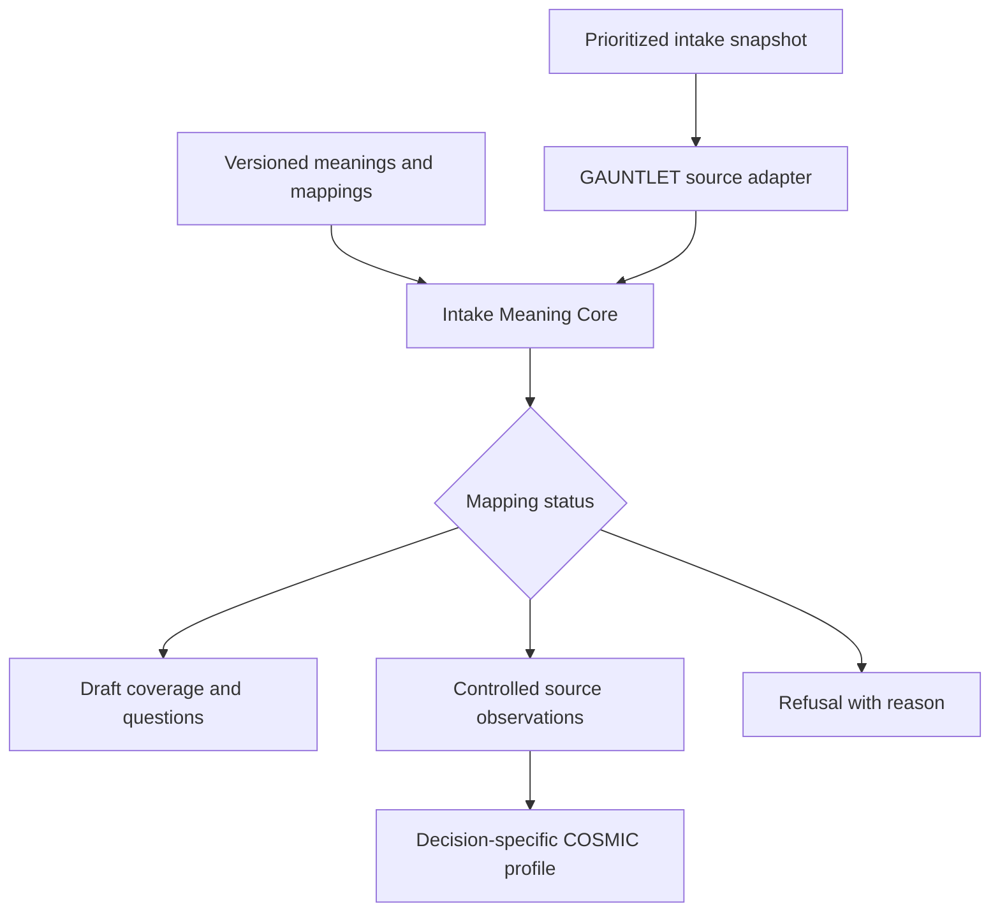

# MANTLE for intake: govern meaning before deciding merit

## The change this package makes

The earlier COSMIC Lite profile required every discretionary request to supply ten economic/evidence fields. Marle reported that the real intake sources do not contain those inputs. A semantic layer must let us ask useful, narrower questions of what exists while keeping unavailable facts unavailable.

MANTLE contributes the missing discipline: decide what a field means at a stated point in time; admit a mapping only within its declared scope; cite the underlying assertion; stop if meaning is ambiguous. It cannot create operational measurements or authority that the sources lack.

The delivered module answers source-level questions such as: which records have a reported owner; which fields were omitted by the fetch path; which reported dates are overdue; which regulatory answers cannot be mapped under the selected definition? It intentionally does not answer whether an application should be built.

## Local integration

The same priority rank and stable record ID pass through unchanged. No new prioritization score is introduced. The existing economic profile remains available for requests that actually have its required inputs. A source-observation profile is distinct from authorization and portfolio admission.

## How the upstream components are used

| Component | Actual use in this edition | Boundary |
|---|---|---|
| PALIMPSEST | Select one meaning valid at `validAt` and known at `knownAt` | Overlap or absence stops interpretation |
| DIALECTIC | Execute identity or explicit enum mapping against supplied records | Wrapper blocks lossy/unsupported transforms, blank coercion, and unmapped fallbacks |
| Authority verifier | Verify signatures over the complete selected meaning, treaty, and snapshot | Key trust and actor authority must be supplied by the server |
| CAIRN | Bind record-scoped claims to source evidence and detect contradictory claim values | A valid citation is not proof that a submitter's assertion is true |
| Kernel receipts | Bind the complete input and output with supporting evidence hashes | Hashing alone is not signed issuance or rollback protection |
| Original STRATA | Not invoked | No numeric certification claimed |

The copied CAIRN implementation checks citation existence, not semantic entailment. The wrapper compensates for this limited use case by generating both citations and narrow SOURCE_ASSERTION claims directly from the same mapped record. It does not use CAIRN to certify arbitrary free-text assertions.

The original low-level DIALECTIC checks a boolean approval and clause hash. It does not independently authenticate an approver. The new CONTROLLED path verifies the full-object signatures first, then constructs the narrow low-level invocation. DISCOVERY explicitly runs proposed transforms as draft interpretations and never emits controlled GAUNTLET context. Its CAIRN result remains REFUSED for uncontrolled sources, even when the overall discovery report is useful; this is intentional and visible.

## Six source states, not a Boolean completeness flag

| State | Exact condition | What Marle should do |
|---|---|---|
| NOT_FETCHED | Source field absent from this row's declared projection | Fetch the supported detail field before asking the submitter |
| ABSENT | Field was in the projection, but no corresponding value key was returned | Investigate adapter/source response semantics |
| BLANK | Source returned null or an empty/whitespace string | Treat as an unanswered source field |
| UNMAPPED | Present, correctly typed source value has no approved enum mapping | Review the mapping; do not default it to false |
| INVALID | Source or mapped value violates its declared type | Correct the source or adapter explicitly |
| OBSERVED | Source value conforms and the declared mapping applies | Preserve as a source assertion, not business approval |

Every coverage report counts these states separately and includes its denominator. A field can have zero observed values because the bulk connector never requested it. That is not evidence that 100% of submitters left it blank.

The per-row `projection` is part of the signed snapshot. Marle must derive it from the actual fetch path, not infer it from which fields happen to be populated. Bulk and per-ticket detail paths can therefore coexist honestly in one report.

## Meanings suited to the reported HLINTAKE sources

The fixture uses synthetic field names. Marle must establish real field IDs and selection semantics locally.

| Canonical observation | Source described in Marle's handoff | Unsupported promotion to avoid |
|---|---|---|
| owner | Product Owner / Area Product Owner detail field | Approval or accountable decision authority |
| requestedChange | Sourced “I want to…” text or another explicit request statement | Causal mechanism, validated need, or outcome measure |
| regulatoryImpactReported | Explicit readiness-questionnaire answer | Verified regulatory obligation or mandatory priority |
| applicationRef | Seal Application/s reference | Confirmed dependency, ownership, or capability equivalence |
| requestedDueAt | Parsed explicit requested due date with documented timezone policy | Authoritative deadline or delivery commitment |
| sizeBand | A source-provided or separately assessed ordinal estimate | Person-days, elapsed days, cost, or capacity |

A meaningful future schema extension can represent multiple application references, multiple owners, field-level revisions, and explicit conflicts across sources. The current scalar schema refuses unsupported shapes. Never flatten a multi-select reference into a fabricated single application.

## Authority without another form-completion dead end

DISCOVERY needs no signers. It exposes fetch gaps, candidate mappings, malformed values, and possible next evidence questions immediately. The output stays advisory and cannot enter the controlled-context path.

CONTROLLED requires an external trusted key configuration. The source signature attests the exact captured snapshot; the treaty signature approves the mapping; the meaning signature approves its definition and time scope. They are distinct signature purposes. The demo uses one ephemeral synthetic key for convenience; real separation of duties is a local design decision.

Do not invent an institution-wide authority framework from a generated demo key. If no appropriate local authority exists yet, keep the integration in discovery. The original policy/authorization problem remains open rather than silently replaced by self-signing.

The library API accepts trust configuration as an explicit argument so a server can supply it. Do not let requesters provide operative trusted keys, select CONTROLLED mode, approve their own mappings, or substitute snapshots after verification. The CLI is an operator tool, not an authenticated network service.

## Historical interpretation and time

`validAt` asks which definition applies to the effective business time. `knownAt` asks which definition was known at the knowledge cutoff. The source's `observedAt` must not be after that knowledge cutoff. The source capture must actually represent the requested historical state; this wrapper cannot recover a historical snapshot from today's Jira response.

Meanings and treaties use half-open intervals. A definition newly known tomorrow cannot be used to reinterpret yesterday's decision as though it were available then. A valid later restatement is a new evaluation with its own explicit knowledge time.

Requested due dates are retained when they are in the past. The output says overdue requested date, not stale evidence or breached obligation. The module accepts explicit UTC instants; translating date-only source fields requires a documented business timezone and end-of-day convention in GAUNTLET.

## The numeric execution boundary still matters

In the original `platform.mjs`, the callback supplied to `runSemanticSandwich` forwards `question` and `domain` to the vendored STRATA bridge; it does not forward the translated records. That is a material integration detail: do not assume the presence of a translated-record receipt proves a downstream metric ran on those records.

This package avoids that ambiguity by not invoking STRATA. If Marle adds a numeric query or certified metric later, its executor must bind the exact admitted dataset/snapshot, metric identity/version, definition, query plan, and returned value. A receipt from an unrelated dataset must be rejected. Add a test that changing the mapped input changes the evaluated dataset identity and, where mathematically applicable, the result.

## Downstream decision contract

`gauntletContext` accepts only a CONTROLLED / VERIFIED_MAPPING result and replays the entire interpretation against the supplied current snapshot, contract, and trust configuration. An edited observation with an otherwise valid receipt is refused. Changed implementation bytes or runtime also change the expected receipt.

The returned context is `gauntlet-semantic-context/v1`. It is not the earlier COSMIC `Intake.evidence[]` contract. A dedicated adapter must decide, for each decision-specific profile, which observed assertions can support which conclusions. No automatic assignment to `permitted`, `need`, financial bounds, or effort/delivery estimates is implemented.

Policy can use a reliable reported owner to route an evidence question. It cannot use that same observation to infer that the owner approved delivery. A reported regulatory flag can trigger obligation investigation. It cannot by itself establish a mandatory obligation or authorize a rejection.

## Persistence and limits

This module is pure evaluation apart from reading its own source for implementation identity. It does not persist evaluations, send messages, query Jira, retrieve documents, run an LLM, or deploy services. Source truth, connector authentication, actual institutional policy, historical snapshots, freshness requirements, and operational permissions must be established locally.

The full MANTLE platform's independent checkpoint authority and append-only ledger are not included in the narrow transfer. Receipt integrity and replay are implemented; signed result issuance, durable audit retention, and rollback resistance are not claimed. The original documentation correctly distinguishes a separate administered authority from a local test harness.

Maximum accepted records per invocation is 10,000 as a schema bound, not a performance guarantee. The inherited evidence contradiction scan is pairwise; benchmark representative local snapshots before adopting that upper limit operationally. The included tests use synthetic cases only.
